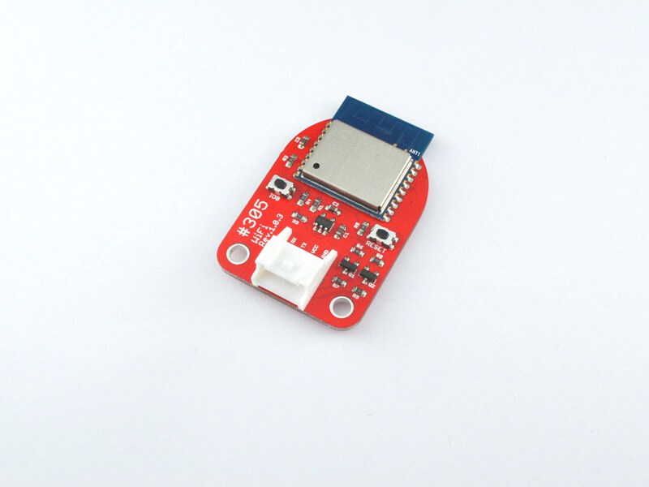

# #305 Wifi Serial Brick

<center>


<!--COLORME-->

## Overview
Wifi通信ができるBrickです。TCPクライアントやアクセスポイント、HTTPサーバになることができます。他にもWifiBrick間で１対１で接続ができます。また、マイコン搭載によりWifiBrickだけでUNOより高性能なArduinoとして単体で活用いただけます。使用できるWifi規格はIEEE 802.11 b/g/nとなっております。

技適マークがありますので安心して日本国内で使用できます。

## Support
|Arduino|
|:--:|
|◯|

## ESP-WROOM-02 Datasheet
|Document|
|--|
|[ESP-WROOM-02 Datasheet Page](https://espressif.com/en/products/hardware/esp-wroom-02/resources)|

## Schematic


##ATコマンドとは？
ATコマンドは、電話回線（モデム）に対して制御するのに開発され、現在でも使われております。WiFiBrickには、あらかじめファームウェアがインストール済みで、ATコマンドの文字列の信号をこのBrickに送信することにより命令ができるようになっています。

## ATコマンド（構文）

|  |コマンド名  |
| -- | -- |
| コマンドを実行する  |AT+コマンド  |
| コマンドの内容表示 | AT+コマンド? |
| コマンド実行引数 | AT+コマンド=引数 |

## ATコマンド（基本コマンド）

|  |コマンド名  | レスポンス |
| -- | -- | -- |
| テスト | AT | OK |
| リセット | AT+RST | Ready |
| ファームウェアのバーション表示 | AT+GMR | バーション表示 |
| コマンドエコー設定 | ATE1 | OK |
| UART通信設定 | AT+UART_DEF=通信速度（９６００bps）,データビット（８ビット）,ストップビット（１）,パリティビット(０),フロー制御（０） | -- |
| TX Power設定 | AT+RFPOWER | -- |
| スリープモード設定 | AT+SLEEP | -- |
| 工場設定 | AT+RESTORE | -- |

## ATコマンド(Wifiコマンド）

|  |コマンド名  | 正常レスポンス |
| -- | -- | -- |
| Wifiの設定 | AT+CWMODE | 1:ステーション(STA) 子機2:アクセスポイント親機3:ステーション、アクセスポイント  例 AT+CWMODE=1|
| アクセスポイント一覧 | AT+CWLAP | SSID名,電波強度,Macアドレス,0:キーなし 2:WPA 3:WPA2  4:WPA_WPA2  |
| アクセスポイントに接続| AT+CWJAP="SSID名","パスワード" | WIFI CONNECTED |
| アクセスポイントの切断| AT+CWQAP |WIF IDISCONNECTED|
| アクセスポイントの設定| AT+CWSAP |AT+CWSAP=SSID名,６４バイトまでのパスワード,チャンネル,暗号(0:オープン2:WPA_PSK 3:WPA2_PSK 4:WPA_WPA2_PSK)|
| アクセスポイントの確認| AT+CWSAP? |---|

## ATコマンド(IPコマンド）

|  |コマンド名  | 正常レスポンス |
| -- | -- | -- |
| IPアドレスの確認 | AT+CIFSR | +CIFSR:STAIP,"IPアドレス"　+CIFSR:STAMAC,"Macアドレス"|
| TCPまたは、UDP接続開始 | AT+CIPSTART="プロトコル名","URL",ポート数 | CONNECT OK|
| 転送設定 | AT+CIPMODE=数字 |AT+CIPMODE=0　非透過モード　AT+CIPMODE=1 透過モード（トランスペアレントモード）|
| データ送信（１）　| AT+CIPSEND=転送接続ID,バイト数(2048バイトまで)|---|
| データ送信（２）　| AT+CIPSEND=バイト数(2048バイトまで)|---|
| データ送信（３）　| AT+CIPSEND |OK　＞　が表示される　参考：データ送信後、+++入力で終了|
| ファームウェア更新 | AT+CIUPDATE |---|
| IP,IPDの表示 | AT+CIPDINFO |---|
| コネクション設定 | AT+CIPMUX=数字 |0:シングル接続 1:多重接続（最大４まで）|
| コネクション設定確認 | AT+CIPMUX? |----|
| サーバの設定 | AT+CIPSERVER=モード数字、ポート数字 |モード 0:サーバー削除、1:サーバー作成　ポート　デフォルト３３３|


## WifiBrickにスケッチを書き込む

これまではArduinoからWifiBrickをATコマンドを使ってWifiの通信をしていましたが、WifiBrickをArduinoのようにすることもできます。WifiBrickにスケッチを書き込むので、以後ATコマンドは使えなくなるのでご注意ください。WifiBrickと#304USB Brickを接続します。#304USB Brickのスイッチは電圧3.3Vにしてください。Arduino IDE(Arduino1.6.11の場合。)を起動します。Arduno->Preference->追加のボードマネージャのボックスにhttp://arduino.esp8266.com/stable/package_esp8266com_index.jsonを代入しOKします。ツール->ボード->ボードマネージャからesp8622 by ESP8266 Communityを選択してインストールします。**参照先以外のファームウェアは、電波法に抵触する可能性があります。絶対に参照または、使用しないでください。**次にツール->ボード->Generic ESP8266 Moduleを選択します。ツール->ボード->Flash Size:"4M(3M SPIFFS)"を選択します。繋がっている任意のポートを選択して、/dev/usbserial*******(Macの場合)、COM**(Windowsの場合)を選択し、WifiBrickのRESETボタンとIO0ボタンを同時に押して、RESETボタンを離します。ArduinoIDEを使ってマイコンボードに書き込みをします。ArduinoIDEの１００％の表示が出たら完了です。IO0ボタンを離します。

以下のサンプルは、WiFiBrickがWebサーバーになるサンプルプログラムです。１０秒ごとにサーバーから
メッセージが表示されるようにしました。

```
//Fabo Sample WebServerTest
#include <ESP8266WiFi.h>
#include <WiFiClient.h>
#include <ESP8266WebServer.h>
#include <ESP8266mDNS.h>
//所属するネットワークSSIDとパスワードを上書きする。
const char *ssid = "ssid";
const char *password = "password";

char count = 0;

ESP8266WebServer server ( 80 );

//メッセージを用意　１０秒ごとに変わる。
char *g[] = {"Good morning!","Good afternoon!","Good evening!"};

void handleRoot() {
  char temp[400];
  
  snprintf ( temp, 400,

"<html>\
  <head>\
    <meta http-equiv='refresh' content='10'/>\
    <title>WifiBrick_Test</title>\
    <style>\
      body { background-color: #ff0000; font-family: Arial, Helvetica, Sans-Serif; Color: #ffffff; }\
    </style>\
  </head>\
  <body>\
    <h1>FROM #305WiFiBrick WebServer!</h1>\
    <h1>Sucess!</h1>\
    <h1>%s</h1>\
  </body>\
</html>",g[count % 3]
  );
  server.send ( 200, "text/html", temp );
  count++;
}

void setup ( void ) {
//指定されたSSIDのネットワークに接続する。
  Serial.begin ( 9600 );
  WiFi.begin ( ssid, password );
  Serial.println ( "" );
//接続を待機する。
  while ( WiFi.status() != WL_CONNECTED ) {
    delay ( 500 );
    Serial.print ( "." );
  }
//接続先の情報を表示する。
  Serial.println ( "" );
  Serial.print ( "SSID=" );
  Serial.println ( ssid );
  Serial.print ( "IP=" );
  Serial.println ( WiFi.localIP() );

  if ( MDNS.begin ( "esp8266" ) ) {
    Serial.println ( "MDNS responder started" );
  }
//サーバー始動
  server.on ( "/", handleRoot );
  server.begin();
  Serial.println ( "HTTP server started" );
}

void loop ( void ) {
  server.handleClient();
}
```
## Parts
- ESP-WROOM-02
