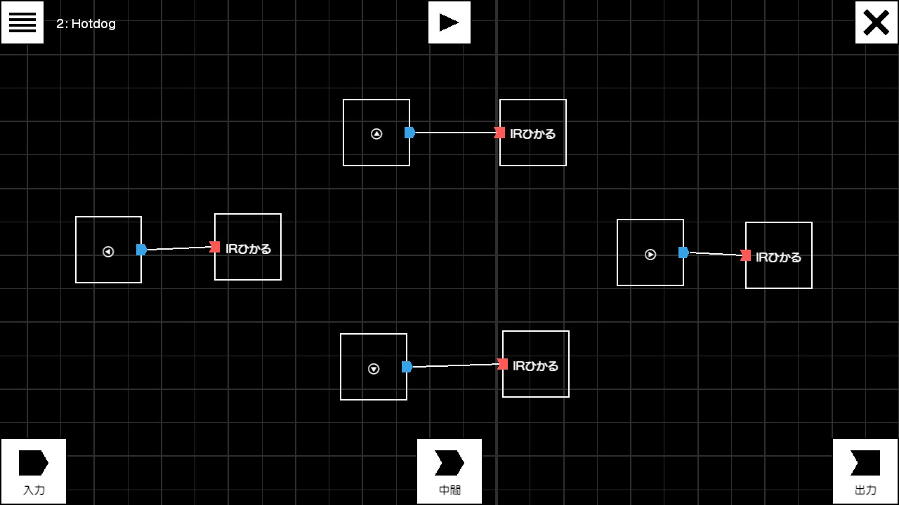

# Nintendo Switch＋IchigoJam+FaBoで制御する。

## 準備するもの

・HotDog本体

・Nintendo Switch

・IchigoJam本体（プログラム打ち込み可能環境含む）

・FaBo モーターシールド

・FaBo IRレシーバー(＃113)

## Nintendo Switchプログラム

入力：右ボタンが押されたら　→ 出力：IRひかる　のばす時間：0.5

入力：左ボタンが押されたら　→ 出力：IRひかる　のばす時間：0.7

入力：上ボタンが押されたら　→ 出力：IRひかる　のばす時間：1.0

入力：下ボタンが押されたら　→ 出力：IRひかる　のばす時間：1.2

を作成する。

それぞれIchigaJamプログラムのT値に対応させるための、のばす時間 です。

## IchigoJamプログラム

JoyCon（＋）IR LEDの点灯時間でFaBoを連携させるプログラムです。

~~~~
10 ‘ 
20 LED 1:WAIT 60:LED 0
30 Z=0:X=0
40 PWM(2),120:OUT(3),0:OUT(4),0
100 A=IN(1)
110 IF A=1 GOTO 200
120 GOTO 110
200 LED 1:T=0
210 A=IN(1)
220 T=T+1:IF A=0 LED 0:GOTO 300
230 GOTO 210
300 ‘
310 IF T>180 AND Z=1 OUT(3),0:OUT(4),0:Z=0:GOTO 100
310 IF T>180 AND T<220 AND Z=0 OUT(3),1:Z=1
320 IF T>240 AND T<280 AND Z=0 OUT(4),1:Z=1
330 IF T>90 AND X=1 PWM(2),120:X=0:GOTO 100
340 IF T>90 AND T<130 AND X=0 PWM(2),145:X=1
350 IF T>140 AND T<180 AND X=0 PWM(2),80:X=1
360 GOTO 100
~~~~

### 10~40　初期設定

電源を入れたら本体LEDを１秒間点灯させる（合図）。

Z値はモーターの状態（０＝停止中 １＝モーター動作中）。

X値はステアリングの状態（０＝中央　１＝どちらかに向いている）。

ステアリングを中央にする。モーターを停止状態にする。

### 100~120　IR受信準備（点灯するまでループする）

IN(1)に繋がっているIRレシーバーの値を取得する。

IRレシーバーが反応したら200行に飛ぶ。反応していないならそのままループする。

### 200~230　IR反応時間（カウンター）を計測

T値＝IR反応時間（カウンター）を0にする（初期化）。

IN(1)に繋がっているIRレシーバーの値を取得する。

T値を増やす。反応がなくなったら300行へ飛ぶ。反応がなくなるまでループする。

### 300~360　T値に対応した動作をさせる

T値が180より高くてZ値が１（モーター動作中）なら、モーターを停止させ、Z値を0にする。100行に飛ぶ。

T値が180から220の間でZ値が0（モーター停止中）なら、モーターを前進させ、Z値を１にする。

T値が240から280の間でZ値が0（モーター停止中）なら、モーターを後退させ、Z値を１にする。

T値が90より高くてX値が１（ステアリングがどちらかに向いている）なら、ステアリングを中央にさせ、X値を0にする。100行に飛ぶ。

T値が90から130の間でX値が0（ステアリングが中央）なら、ステアリングを右に向け、X値を１にする。

T値が140から180の間でX値が0（ステアリングが中央）なら、ステアリングを左に向け、X値を１にする。

100行に飛ぶ。

